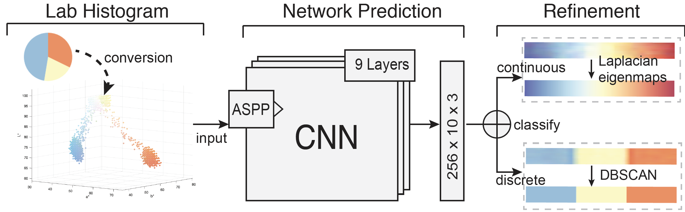

# Deep Colormap Extraction from Visualizations

This repository contains code and materials for the paper _Deep Colormap Extraction from Visualizations,_ contributed by Lin-Ping Yuan, Wei Zeng, Siwei Fu, Zhiliang Zeng, Haotian Li, Chi-Wing Fu, and Huamin Qu. All rights reserved by authors.

-----
## Introduction
This work presents a new approach based on deep learning to automatically extract colormaps from visualizations. After summarizing colors in an input visualization image as a Lab color histogram, we pass the histogram to a pre-trained deep neural network, which learns to predict the colormap that produces the visualization. To train the network, we create a new dataset of ∼64K visualizations that cover various data distributions, chart types, and colormaps. The network adopts an atrous spatial pyramid pooling module to capture color features at multiple scales in the input color histograms. We then classify the predicted colormap as discrete or continuous, and refine the predicted colormap based on its color histogram.



## Datasets

The synthetic visualization datasets, the colormaps used for producing the visualizations, and real-world images used for evaluation can be downloaded from [here](https://bit.ly/2rOJTNw).

## Usage
The code contains three modes of input:
Mode 0: the input is 3D Lab histogram.
Mode 1: the input is 2D Lab histogram.
Mode 3: the input is original images with the PNG format.

Let us take the third mode as an example. To run the code, there are three steps:

### Split datasets
- Download the datasets from [here](https://bit.ly/2rOJTNw) and put them in the folder ./dataset. 
- Get training, testing, evaluating file lists by running:
```
python utils/gen_file_lists.py 63956 *.png *.png.   # 63956 is the number of total pairs of visualization and colormaps; you can first train any 500 visualization-colormap pairs to check whether the code works for you by creating the chart/ and legend/ folders with only 500 items.
```
Then, the ./dataset folder will include the following items: chart/, legend/, train.txt, test.txt, and evaluate.txt

### Training
```
train.py --with_aspp True --backbone resnet18 --mode 2 --legend_width 512 --legend_height 20 --image_width 512 --image_height 256
```
You can resize the images and legends to a smaller size to reduce the training time. If so, remember to change the legend_width, legend_height, image_width, and image_height parameters accordingly.

### Testing
```
python inference.py --with_aspp True --backbone resnet18 --mode 2 --legend_width 512 --legend_height 20 --image_width 512 --image_height 256 --trained_model_config xxx # xxx is the trained model file name
```
